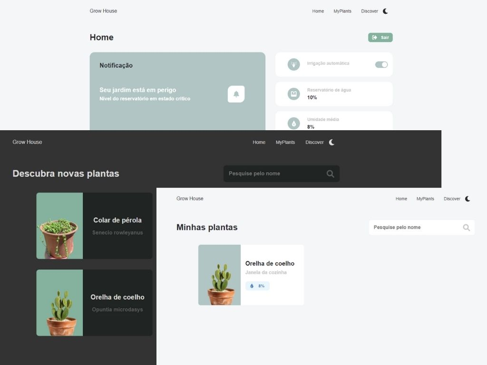

 

  <h3 align="center">Grow House Web</h3>

  

    Site para gerenciar seu jardim
  

  
Índice

    <ol>
    <li>
      <a href="#sobre-o-projeto">Sobre o projeto</a>
      <ul>
        <li><a href="#construido-com">Construido com</a></li>
      </ul>
    </li>
    <li><a href="#contato">Contato</a></li>
  </ol>

## Sobre o projeto

Esse site foi construído como um complemento do aplicativo [GrowHouse](https://github.com/william-james-pj/GrowHouse), do qual auxilia no cultivo em jardins verticais caseiros através de um sistema de monitoramento e irrigação. Dessa forma, o site permite que o usuário tenha acesso aos dados do seu jardim através de uma plataforma web.

[Link do site](https://growhouse-d6bd0.web.app/)

### Construído com

O projeto foi construído utilizando:

- [Reactjs](https://reactjs.org)
- [TypeScript](https://www.typescriptlang.org)

## Contato

William James - william.james.pj@gmail.com

Link do projeto: [https://github.com/william-james-pj/grow-house-web](https://github.com/william-james-pj/grow-house-web)
